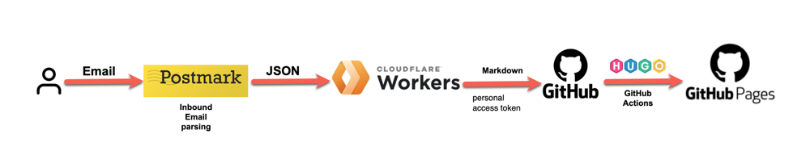
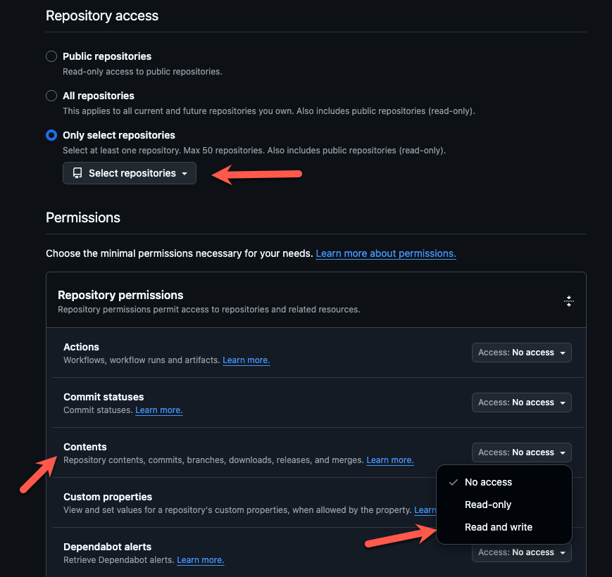
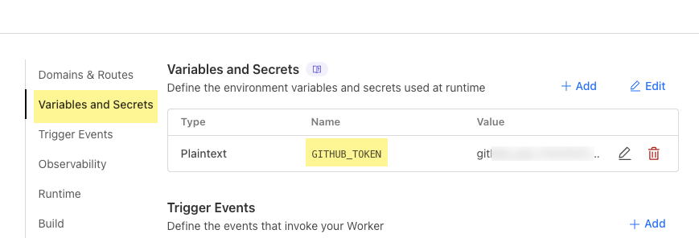
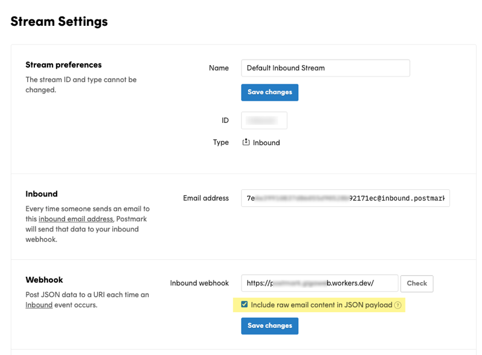

# Mail to Blog

## Introduction

*Mail to Blog* is a streamlined workflow that allows users to publish blog posts directly via email. There's no need to log into a CMS dashboard or use any third-party application. Simply send an email where the subject becomes the post title and the body becomes the content. The post is published within seconds.

## Tech Stack

- Postmark: Inbound email parsing
- Hugo + GitHub: Static site generator and hosting
- Cloudflare Workers: Receives parsed email data, converts to Markdown, commits to GitHub

## One-Time Setup

### Hugo Site

- Create a new GitHub repository.
- Clone it locally.
- Initialize a Hugo site, configure a theme, and set up GitHub Actions for automatic deployment.
- Using Hugo is totally optional. You can use any static site generator like Jekyll etc.

For convenience, a sample Hugo setup with pre-configured theme and GitHub Actions is [available here](https://github.com/gigaArpit/sample-hugo-site).

### Generate GitHub Token

Visit [this link](https://github.com/settings/personal-access-tokens/new) to create a personal access token with the following configuration:

- Repository Access: Restrict to the above repository
- Permissions: Contents → Read and Write

### Cloudflare Worker

Sign-up for Cloudflare Workers, and create a new worker from the web interface. Use [this sample script](worker.js), which does the following things:

- Accepts `POST` requests from Postmark's inbound webhook
- Converts the parsed email content to Markdown
- Commits a new post to GitHub using your personal access token

Don't forget to modify the above sample script by entering correct GitHub username and repo name etc. (see instructions at the script end).

Once deployed the Worker script, record its URL for later use. Try opening this URL in browser, and you should get `Method Not Allowed` error, as it receives only `POST` requests.

Go to its Settings, and under the "Variables and Secrets", save a new environment variable with name `GITHUB_TOKEN`, and value as your GitHub access token created in previous step.

### Postmark

Postmark handles inbound email parsing:

- It assigns you an address like `yourhash@inbound.postmarkapp.com` (customizable with your custom domain).
- It parses incoming emails into structured JSON.
- It sends this JSON to your configured webhook (the above Cloudflare Worker).

Steps to configure:

- Sign up for Postmark, Create a server
- In the Inbound settings, set the webhook URL to your Worker
- Note your unique inbound email address

The free tier includes 100 inbound emails/month, which should be enough for most individuals. You can upgrade for paid plans if planning to extend this idea.

## Publishing

After completing above one-time setup:

- Send an email to your Postmark inbound address
- Postmark parses and forwards the content to Cloudflare Worker
- The Worker pushes a Markdown file to your GitHub repo, with email subject as the post title; and email body as the post content
- GitHub Actions rebuild the Hugo site, and deploys to Cloudflare Pages platform

Your new post will appear on the live site within minutes.

You can share your Postmark inbound address with your friends and family, and easily start a group blog too.

## Demo

You can see my example [site here](https://quotes.microgeek.dev/) and its [source code here](https://github.com/gigaArpit/quotes), which uses the above workflow. I have setup a custom domain to my GitHub site as well. I would post my collected quotes here.

## Summary

- While the initial setup involves several steps, the system runs seamlessly once configured.
- You won’t need any paid subscriptions, Cloudflare Workers and Postmark both offer generous free tiers that easily cover the needs of a personal blog. This makes the workflow not only efficient but also cost-effective, giving you a frictionless publishing pipeline entirely through email.
- It follows [File over App](https://stephango.com/file-over-app) philosophy. Your data is not locked with any app or platform. Since everything is stored as markdown, you can easily switch any component anytime. Like, Hugo can be replaced with Jekyll etc.
